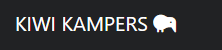
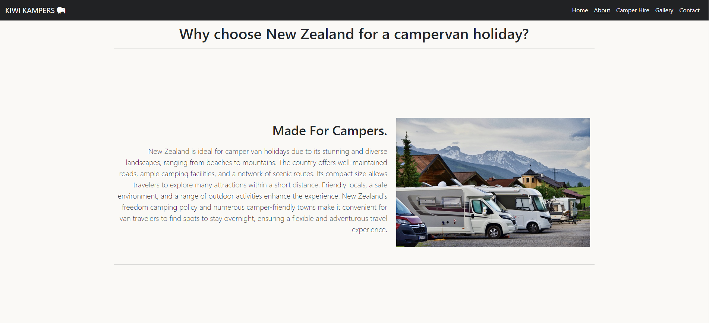
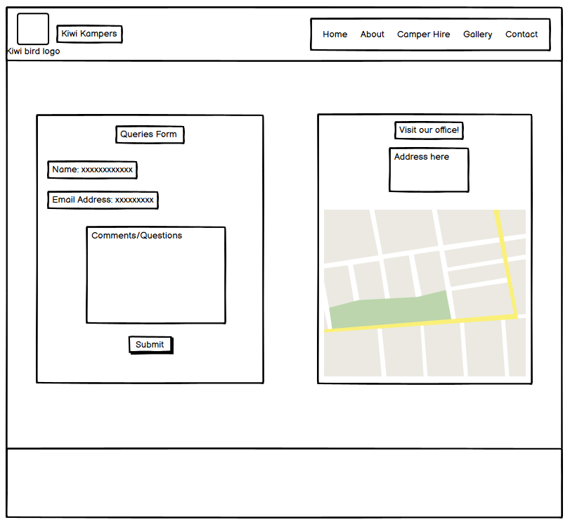

# KIWI KAMPERS

# Table Of Contents

* [Overview](#overview)
* [User Experience](#user-experience)
* [Features](#features)
* [Wireframes](#wireframes)
* [Deployment](#deployment)
* [Testing](#testing)
* [References](#references)
* [Tools and Technologies](#tools-and-technologies)
* [Acknowledgements](#credits)

---

# Overview

Kiwi Kampers is an informative website detailing campervan life in New Zealand. The website will have information on the benefits of seeing the country in a campervan, campervan hire companies, with supplied links, and a contact form that can be subbmitted for questions and additional information.

# User Experience

## Target Audience

- Ages 25-40 but can appeal to all ages.
- All genders.
- Those with a passion for the outdoors.
- Those looking for adventure holidays.
- Those who are seeking cultural experiences.
- Couples and families with or without children.

## First Time Visitor Goals

- Immediately know what the website is about and the intended purpose of giving infromation on campervan life in New Zealand.
- Be able to navigate the website with ease with all links working as they should.
- Be able to get back to the home page or any other site page without having to use the forward or back button.
- Have confidence in the website by sensing that the website is genuine and professional i.e. no broken links or typos.
- Be able to find and navigate to campervan hire companies easily from the website.
- Be able to submit a form to request additional infromation.

## Returning Visitor Goals

- Find campervan hire companies based on their budget.
- Use the form to ask for additional information. 
- Browse the gallery to help them make decisions.

## Frequent Visitor Goals

- Use the social links to connect with like minded people.
- Use the map/address to visit the office directly for a meeting.
- Use the campervan hire links to book repeat services.

# Features

## Navbar

A navigation menu with clearly defined links.
- Home - to navigate back to the homepage at anytime - also can be accessed by clicking the Kiwi Kamper logo.
- About - to navigate to the 'about' page.
- Camper Hire - to navigate to the 'hire information' page.
- Gallery - to navigate to the websites gallery.
- Contact - to navigate to the map and contact form.

Navbar desktop view:

Navbar mobile closed view:

Navbar mobile open view:

### Navbar Interaction

- Inverted colours when menu items are hovered over.
- Current page will be underlined in the navbar.
- Clicking on logo will always return user to homepage.
- Menu transforms into a 'hamburger' menu on smaller devices or when window is reduced.

## Favicon

- Kiwi favicon icon in site tab to match webiste theme.

Themed favicon:

# Site Pages

## Home

- Logo and navbar.
- Welcoming, full-width 'hero' image and text.
- 3 information blocks with clickable link buttons that navigate to corresponding pages on the site - buttons fade when hovered over.
- Social media links that open in new tabs.

Home page preview:

Logo:

## About

- Logo and navbar
- 3 sections with information.
- 3 embedded images that correspond to the information given.
- Social media links that open in new tabs.

About page preview:

## Camper Hire

- Logo and navbar.
- 3 sections showing external companies based on budget.
- 3 embedded images that correspond to the information given.
- Clickable hyperlinks that take you to external links in a new tab.
- Social media links that open in new tabs.

Hire page preview:

## Gallery

- Logo and navbar.
- 20 image gallery.
- Clicking an image will open full-size in a new tab.
- Social media links that open in new tabs.

Gallery page preview:

## Contact

- Logo and navbar.
- Embedded map with relevant location - interactive.
- Contact form.
- Name - required.
- E-mail - required and also @ required.
- Comment/question - required.
- Submit button with 'paper plane' icon.
- Social media links that open in new tabs.

Contact page preview:

## Form complete

- Logo and navbar.
- Themed page with thank you message.
- Social media links that open in new tabs.

Submitted page preview:

## Custom 404

- Logo and navbar.
- Custom themed image.
- Link back to home page.
- Social media links that open in new tabs.

404 page preview:

# Footer

- 3 social media links.
- Links open in a new tab.

Page footer:

# Design

### Colours

- Dark colours and lights colours used to compliment the green hero image and vibrant gallery.
- Header and navbar set in dark grey with white text.
- Menu items change to white with grey text - inverted from normal when hovered.
- Body is light coloured off-white to ensure the contrast between dark colours is apealing.

Colour palette:

### Fonts

- Google fonts supplied all text styles.
- Oswald font used on home and contact pages.
- Segoe UI used on about and hire pages.

- Font Awesome was used for the social media link icons, the logo icon and for the favicon icon.

# Wireframes

- Balsamiq was used to create the wireframes.

Home page:

About page:

Hire page:

Gallery page:

Contact page:

# Deployment

### Github Pages

The site was deployed to Github Pages using the following method:

- Go to the Github repository.
- Navigate to the 'settings' tab.
- Using the 'select branch' dropdown menu, choose 'main'.
- Click 'save'.

### Local deployment and cloning

To make a clone of the site and ensure you don't affect the original:

- Navigate to the Github repository that you want to clone.
- Click on the 'down'arrow on the green 'code' button.
- Copy the URL link.
- Open the workspace with the green 'open' button.
- In the command terminal enter 'git clone' followed by the copied url.
- Press enter to create the clone.

# Testing

Please go to [testing.md](testing.md) to see the test procedures and results.

# References

### Images

All images are royalty free and were taken from allowed sources. Images are downloaded and added to the assets file to ensure no broken links arise.

Hero image:

- https://pixabay.com/photos/road-highway-trees-forest-5638011/

About page images:

- https://pixabay.com/photos/camping-motorhome-traveling-camper-5099382/

- https://pixabay.com/photos/nature-fog-landscape-sky-mountain-2466927/

- https://pixabay.com/photos/skydiving-paraglider-parachute-4896892/

Hire page images:

- https://pixabay.com/photos/couple-van-field-camper-sunset-6705684/

- https://www.pexels.com/photo/a-couple-lying-together-in-a-bed-inside-a-motorhome-7476234/

- https://www.rawpixel.com/image/6111384/photo-image-public-domain-beach-free

Gallery images:

- https://www.pexels.com/photo/two-brown-lama-3396657/

- https://unsplash.com/photos/concrete-road-surrounded-by-trees-ah3_UdEGLcI

- https://www.pexels.com/photo/brown-and-orange-house-with-outdoor-plants-2259917/

- https://unsplash.com/photos/person-on-beige-bridge-at-mountain-valley-0FXa9sTV6Kw

- https://unsplash.com/photos/person-on-beige-bridge-at-mountain-valley-0FXa9sTV6Kw

- https://www.pexels.com/photo/vehicles-parked-on-field-587976/

- https://www.pexels.com/photo/photo-of-person-riding-kayak-3413678/

- https://www.pexels.com/photo/white-car-traveling-near-trees-during-daytime-24698/

- https://www.pexels.com/photo/camper-van-near-a-lake-4499511/

- https://www.pexels.com/photo/people-riding-on-inflatable-boat-1732278/

- https://www.pexels.com/photo/couple-riding-parachute-together-739657/

- https://www.pexels.com/photo/body-of-water-near-city-buildings-421927/

- https://www.pexels.com/search/van%20life/

- https://www.pexels.com/photo/photo-of-falls-during-daytime-3686883/

- https://unsplash.com/photos/a-hot-air-balloon-flying-over-a-field-of-tall-grass-Ur3YO_FD_ug

- https://www.pexels.com/photo/brown-wooden-dock-on-seashore-2226900/

- https://www.pexels.com/photo/red-maori-totem-pole-against-blue-sky-6492113/

- https://www.pexels.com/photo/white-furred-animals-on-green-grass-field-710263/

- https://www.pexels.com/photo/sky-tower-in-auckland-831910/

- https://www.pexels.com/photo/brown-and-white-mountain-633198/

### Code

Some code copied and pasted as a guide and highly edited to suit the site theme.

Navbar and hamburger menu:

- https://getbootstrap.com/docs/4.0/components/navbar/

Home page layout:

- https://getbootstrap.com/docs/4.0/examples/jumbotron/

About page layout:

- https://getbootstrap.com/docs/4.0/examples/carousel/

Hire page layout:

- https://getbootstrap.com/docs/4.0/examples/carousel/

Gallery layout:

- https://bootsnipp.com/snippets/aMGnk

Contact page:

- https://bootsnipp.com/snippets/bx5W6

# Tools and Technologies

- [canva](https://www.canva.com/) to create custom 404 page image.
- [HTML](https://en.wikipedia.org/wiki/HTML) was used to write the website code.
- [CSS](https://en.wikipedia.org/wiki/CSS) was used to style the website.
- [Bootstrap](https://getbootstrap.com/) was used for the site layout.
- [Gitpod](https://gitpod.io/) as online IDE.
- [Github](https://github.com) and Github Pages to deploy and host the website.
- [FontAwesome](https://fontawesome.com/) for website icons and the favicon.
- [Bootsnipp](https://bootsnipp.com/) to copy code examples.
- [Google](https://www.google.co.uk/) as a search engine for all queries.
- [GoogleChrome](https://www.google.com/intl/en_uk/chrome/?brand=QCTP&gad_source=1&gclid=CjwKCAjwhIS0BhBqEiwADAUhc2pz-_bvU7f850ozLnJ1cfu6Y8tIfP4BXfL7naeQKo15Tjzwkt3U5hoClfYQAvD_BwE&gclsrc=aw.ds) to test and view website.
- [GoogleDevTools](https://developer.chrome.com/docs/devtools) to identify bugs and general website tailoring.
- [TinyPNG](https://tinypng.com/) to convert images from png to webp.
- [MicrosoftPaint](https://www.microsoft.com/en-gb/windows/paint) to resize images.
- [coolors](https://coolors.co/) to create the colour palette.
- [Balsamiq](https://balsamiq.com/) to create the wireframes.
- [ResponsiveViewer](https://responsiveviewer.org/) to create multiple device image.

# Acknowledgements

A big thank you to my cohort facilitator, Lewis Dillon, my mentor, Gareth McGirr, fellow students and their support and Joshua Thorley for advice and support.