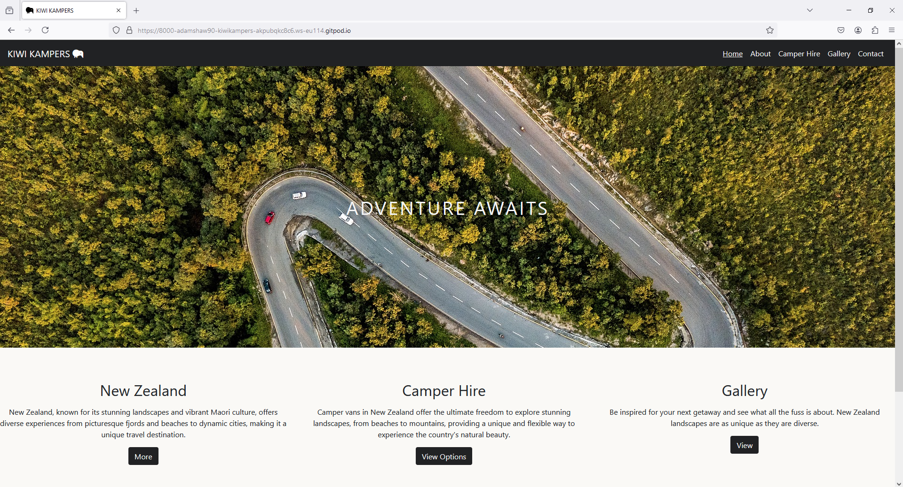

# Testing

## Table Of Contents

1. [Code Validation](#code-validation)
1. [Site Responsiveness](#site-responsiveness)
1. [Manual Testing](#manual-testing)
1. [Browser Compatibility](#browser-compatibility)
1. [Performance](#performance)
1. [Bugs](#bugs)
1. [Unsolved Bugs](#unsolved-bugs)

# Code Validation

### HTML

### Home page:

- No errors or warnings to show.

### About page:

- No errors or warnings to show.

### Hire page:

- No errors or warnings to show.

### Gallery page:

- No errors or warnings to show.

### Contact page:

- No errors or warnings to show.

### Submit page:

- No errors or warnings to show.

### 404 page:

- No errors or warnings to show.

### CSS

# Site Responsiveness

The website has been tested on multiple devices to ensure responsiveness remains on whatever device the webisite is loaded to.

### Desktop

### Iphone 14

### Ipad

### Kindle Fire

### Samsung S20

# Manual Testing

Manual testing was carried out on all elements of the site to ensure that everything worked as expected.

|

# Browser Compatibility

This website has been tested across multiple browsers to ensure it can be transitioned smoothly.

### Google Chrome:

- No issues.

### Mozilla Firefox:

- No issues.

### Microsoft Edge:

- No issues.

# Performance

Lighthouse was used to verify that the web pages are performing well and are are well optimized.

### Home page:

### About page:

### Hire page:

### Gallery page:

### Contact page:

### Submit page:

### 404 page:

# Bugs

# Unsolved Bugs

